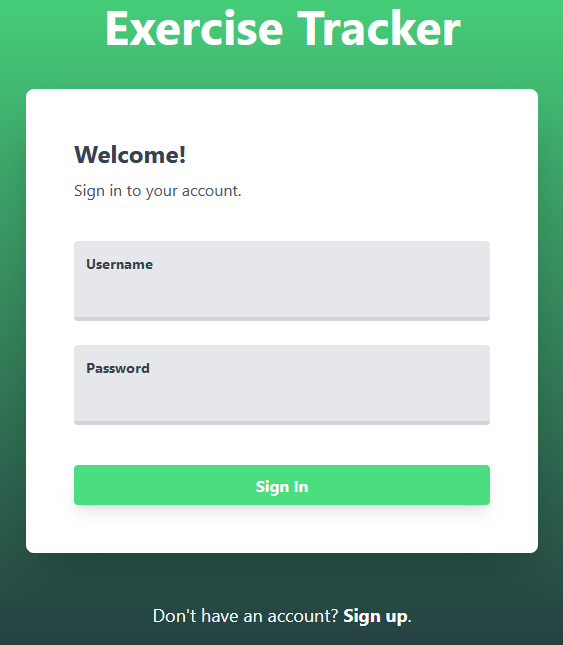
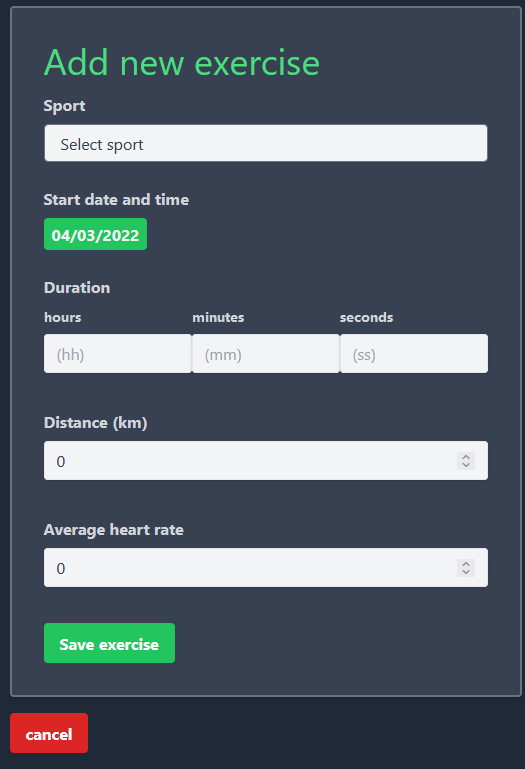
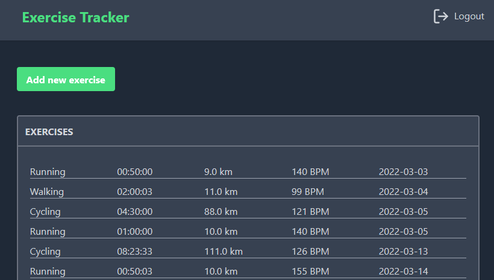
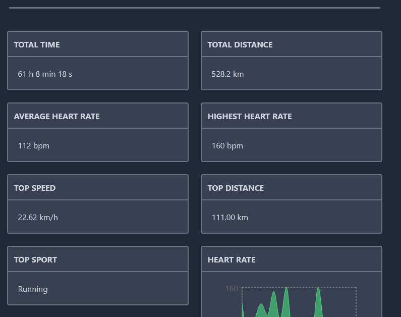
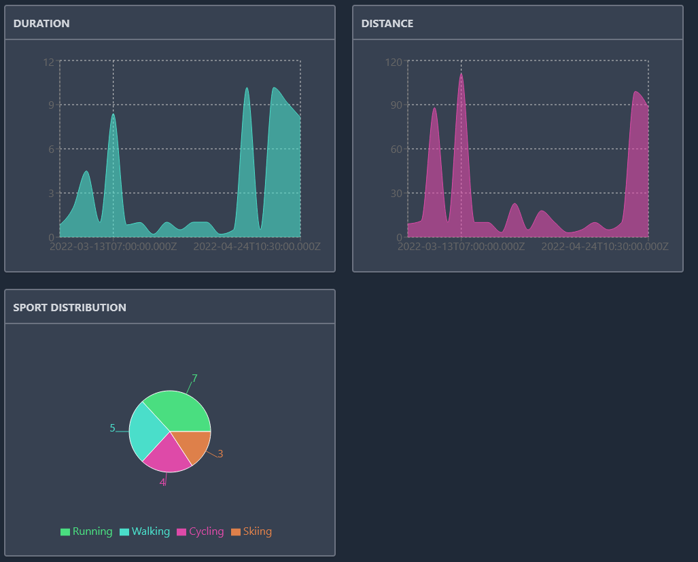

# React frontend for exercise tracker

Live: <https://evening-sierra-51700.herokuapp.com/>

Exercise tracker frontend to use with the exercise tracker server.

## Screenshots

Login:

Add exercise -form:

Exercise list:

Exercise data processing:

Exercise graphs:

## Installation and running

1. Clone repo.

2. `npm install` in the project root directory.

3. `npm start` for running the app. For local use, you must have the exercise tracker server running at the same time. Instructions for the server are in the server project.

For serving this frontend on the node server (for hosting purposes), build the project and copy the build directory to the root directory of the server.
